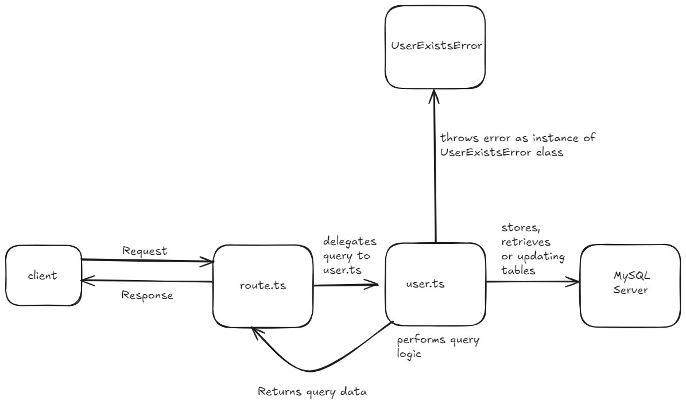

# Next.js Backend Project

## Overview
This project is a backend implementation using Next.js, focusing on building RESTful APIs, JWT-based authentication, and database interactions with MySQL hosted in a Docker container.

---

## Features

### 1. **Routing**
- Next.js routing is utilized by creating folders within the `app` directory.
- Each folder acts as a route, and `route.ts` files define the request functionalities for these routes.

### 2. **Authentication**
- JWT-based authentication is implemented using the `jose` library for Edge Runtime compatibility.
- Middleware is used to verify tokens for protected routes.

### 3. **Database**
- MySQL is hosted in a Docker container using the following `docker-compose.yml` configuration:

```yaml
docker-compose.yml
version: '3.8'

services:
  mysql:
    image: mysql:latest
    container_name: mysql-container
    restart: always
    ports:
      - "3306:3306"
    environment:
      MYSQL_ROOT_PASSWORD: ${MYSQL_ROOT_PASSWORD}
      MYSQL_DATABASE: ${MYSQL_DATABASE}
      MYSQL_USER: ${MYSQL_USER}
      MYSQL_PASSWORD: ${MYSQL_PASSWORD}
    volumes:
      - mysqldata:/var/lib/mysql

volumes:
  mysqldata:
```

- Database interactions are handled using the `mysql2` library.

### 4. **API Endpoints**

#### Authentication Endpoints
- **Login** (`POST /api/(auth)/login`): Handles user login and issues JWT tokens.
- **User Management**:
  - `GET /api/(auth)/users`: Fetch all users.
  - `POST /api/(auth)/users`: Create a new user.
  - `PATCH /api/(auth)/users/[id]`: Update user details.

#### Reports Endpoints
- **Reports**:
  - `GET /api/reports`: Fetch all reports or filter by user.
  - `POST /api/reports`: Create a new report.

### 5. **Middleware**
- Middleware is used to verify JWT tokens for protected routes.
- Public routes are excluded from token verification.

---

## Learning Notes

### Day 1
1. Learned Next.js routing and how folders in the `app` directory map to routes.
2. Set up Docker to host a MySQL container for database experimentation.
3. Used DBeaver to interact with the MySQL database.
4. Built RESTful APIs using Next.js.
5. Revised MySQL query basics.

### Day 2
1. Created middleware for JWT token verification.
   - Encountered an error: `"The edge runtime does not support Node.js 'crypto' module."`
   - Resolved by replacing `jsonwebtoken` with the `jose` library for Edge Runtime compatibility.
2. Implemented JWT-based login sessions.

---

## Project Structure

```
next-backend/
├── app/
│   ├── api/
│   │   ├── (auth)/
│   │   │   ├── login/
│   │   │   │   └── route.ts
│   │   │   ├── users/
│   │   │   │   ├── route.ts
│   │   │   │   └── [id]/
│   │   │   │       └── route.ts
│   │   ├── reports/
│   │   │   └── route.ts
├── lib/
│   ├── auth.ts
│   ├── db.ts
│   ├── error.ts
│   ├── report.ts
│   └── user.ts
├── middleware.ts
├── docker-compose.yml
├── package.json
└── README.md
```

---

## Diagram



---

## How to Run

1. **Start MySQL with Docker**:
   ```bash
   docker-compose up -d
   ```

2. **Install Dependencies**:
   ```bash
   npm install
   ```

3. **Run the Development Server**:
   ```bash
   npm run dev
   ```

4. **Access the API**:
   - Example: `http://localhost:3000/api/(auth)/login`

---

## Future Improvements
1. Add password hashing for user authentication.
2. Implement role-based access control.
3. Add unit and integration tests.
4. Improve error handling and logging.
